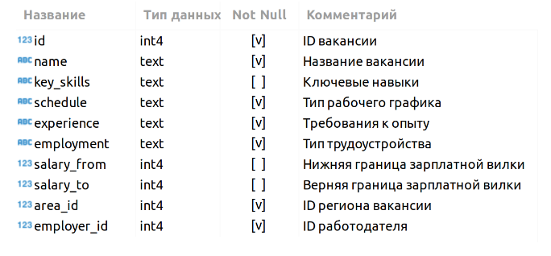
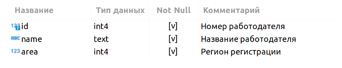
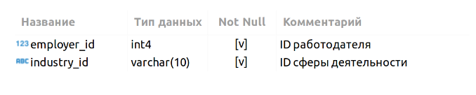

# Проект. Анализ вакансий из HeadHunter 

### Описание проекта    
Познакомимся с каждой таблицей.

**VACANCIES**

Таблица хранит в себе данные по вакансиям и содержит следующие столбцы:

Смотреть Фантомас в HD 720-1080 хорошем качестве

Зарплатная вилка — это верхняя и нижняя граница оплаты труда в рублях (зарплаты в других валютах уже переведены в рубли). Соискателям она показывает, в каком диапазоне компания готова платить сотруднику на этой должности.

**AREAS**

Таблица-справочник, которая хранит код города и его название.

**EMPLOYERS**

Таблица-справочник со списком работодателей.

**INDUSTRIES**

Таблица-справочник вариантов сфер деятельности работодателей.

**EMPLOYERS_INDUSTRIES**

Дополнительная таблица, которая существует для организации связи между работодателями и сферами их деятельности.

Эта таблица нужна нам, поскольку у одного работодателя может быть несколько сфер деятельности (или работодатели могут вовсе не указать их). Для удобства анализа необходимо хранить запись по каждой сфере каждого работодателя в отдельной строке таблицы.

### Какой кейс решаем?    
Представьте, что вы устроились на работу в кадровое агентство, которое подбирает вакансии для IT-специалистов. Наш проект — создание модели машинного обучения, которая будет рекомендовать вакансии клиентам агентства, претендующим на позицию Data Scientist. Сначала вам необходимо понять, что из себя представляют данные и насколько они соответствуют целям проекта. В литературе эта часть работы над ML-проектом называется Data Understanding, или анализ данных.

**Наш проект включает в себя несколько этапов:**
* знакомство с данными
* предварительный анализ данных
* детальный анализ вакансий
* анализ работодателей
* предметный анализ

**Что практикуем**     
* Учимся писать хороший код на python
* Учимся работать с IDE
* Учимся работать с GitHub
* Учимся строить и анализировать графики
* Учимся работать с таблицей
* Учимся делать запросы и работать с PostgresSQL

### Результаты:  
Обобщая имеем следующие, половина заявок приходится на города-милионники. При этом топ20 вакансий по количеству заявок относится к сфере IT, самые большие показатели у "Системный администратор" и "Программист 1С", неплохие показатели и у "DS". Также можно отметить, что по графику количество вакансий плавно возрастает, но как это приблизительный график, так как из топ20(любая таблица) можно было заметить, что некоторые вакансии имеют дубликаты и считаются разными, когда это не так. Касаемо вакансий, которые имеют отношение к данным, им принадлежит ~4%, что говорит о популярности направления. У DS в среднем требуется 6-7 навыков. Чаще всего требуется наличие опыта 1-3 лет, а средняя ЗП 71-110 тыс. руб. Больше свего заявок от Яндекс, Ростелеком, Тинькофф, СБЕР, Газпром нефть - крупные игроки рынка. Можно также заметить, что не хватает данных о зарплате, например у DS с опытом от 6 лет ЗП не известна.

По поводу продолжения исследования, нужно разобраться с дубликатами(трудная задача, так как названия очень похожи), сократить количество пропусков в данных(ЗП, может быть еще что-то). Тогда можно заново оценить топ популярных профессий, посмотреть в каких городах они расспологаются и сколько платят в зависимости от опыта. Также можно оценить в каких городах больше всего требуются высококвалифицированные кадры, потому что там должны находиться сильные "игроки-компании", а где больше набирают "молодых" специалистов. Можно добавить пункт о сфере деятельности в этот анализ, чтобы лучше понимать специфику рынка. Дальше можно поанализировать отдельные направления (DS и другие), если мы хотим понять, что происходит в конкретной сфере. Посмотреть какие навыки популярны, как зависит ЗП от графика работы и занятости и другое 
 

### Выводы:  
Был получен опыт анализа таблиц и нахождения зависимостей между различными признаками, немного прокачали навык запросов SQL.  
